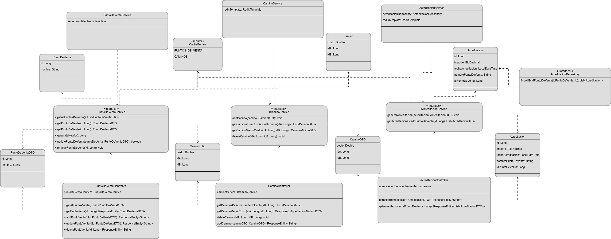

# Java Challenge 2025 

## Instrucciones para correr el proyecto
1. Clonar el repositorio
2. ejecutar el comando `docker build -t challenge-java .` para construir la imagen de docker del proyecto
3. ejecutar el comando `docker-compose up` para levantar el proyecto, esto levantará la app Java expuesta en el puerto 8088
, una instancia de MySQL exponiendo el puerto 42333 en la maquina local y usando el 3306 en el contenedor y una instancia de Redis en el puerto 6379

## Endpoints http

### Puntos de Ventas
* GET /puntos Obtiene todos los puntos de venta en la cache.
* GET /puntos/{id} Obtiene un punto de venta en base a su Id.
* POST /puntos Añade un punto de venta a la cache.
Ejemplo: 
```json
{
    "id": 20,
    "nombre": "rio negro"
}
```
* PUT /puntos Actualiza un punto de venta en la cache. En el caso de que no exista ese punto lo crea.
* DELETE /puntos/{id} Elimina un punto de venta de la cache. 

### Caminos y costos
* GET /caminos/{id} Obtiene todos los caminos directos desde ese Id de punto de venta. 
* POST /caminos Añade un camino directo entre dos puntos. Si el camino ya existe, actualiza el costo. Ejemplo:
```json
{
    "idA": 1,
    "idB": 10,
    "costo": 20.0
}
```
* GET /caminos/{idA}/{idB} Obtiene el camino de menor costo entre dos puntos especificando el nombre y el id de cada punto al igual que el costo total (no muestra el costo individual de cada camino). 
* DELETE /caminos/{idA}/{idB} Elimina un camino directo entre dos puntos. 

### Acreditaciones
* POST /acreditaciones Genera una acreditación que se persiste en la base de datos con el nombre con la fecha de la misma y el nombre del punto. Ejemplo de body:
```json
{
    "idPuntoDeVenta": 1,
    "importe": 20.0
}
```
* GET /acreditaciones/{idPuntoDeVenta} Obtiene todas las acreditaciones de un punto de venta en base a su Id. 


## Descripción

### Tecnologías Utilizadas

* Java 21
* Spring Boot 3.4.1
* MySQL 5.7.4
* Maven
* Redis Cache
* JPA

## Aclaraciones
* Usé DTOs y ModelMapper para mapear de DTO a entidad y viceversa ya que a pesar de que hay entidades que no están 
siendo persistidas me pareció una buena practica para mantener las validaciones de Jakarta Validation desacopladas de 
la entidad que quizá en algún momento se quiera persistir o modificar. 

## Suposiciones
* Asumo que al cargar un camino directo entre un punto A y un punto B, 
y ya se encontraba ese camino, funcionaria como una actualización de costo. 

